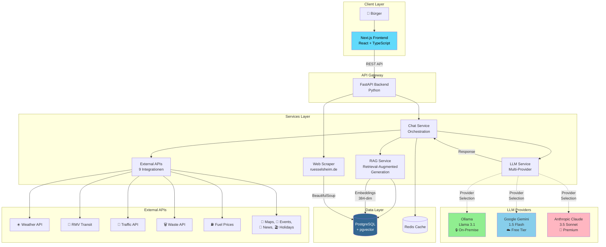
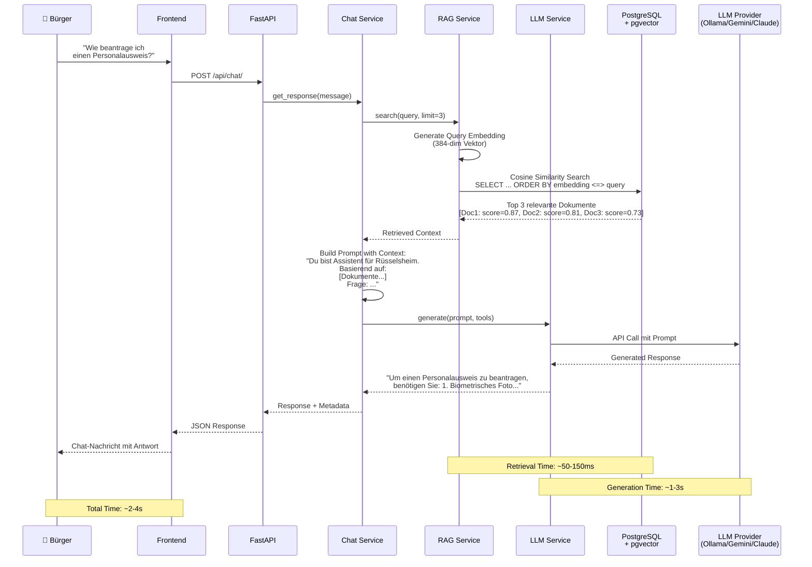
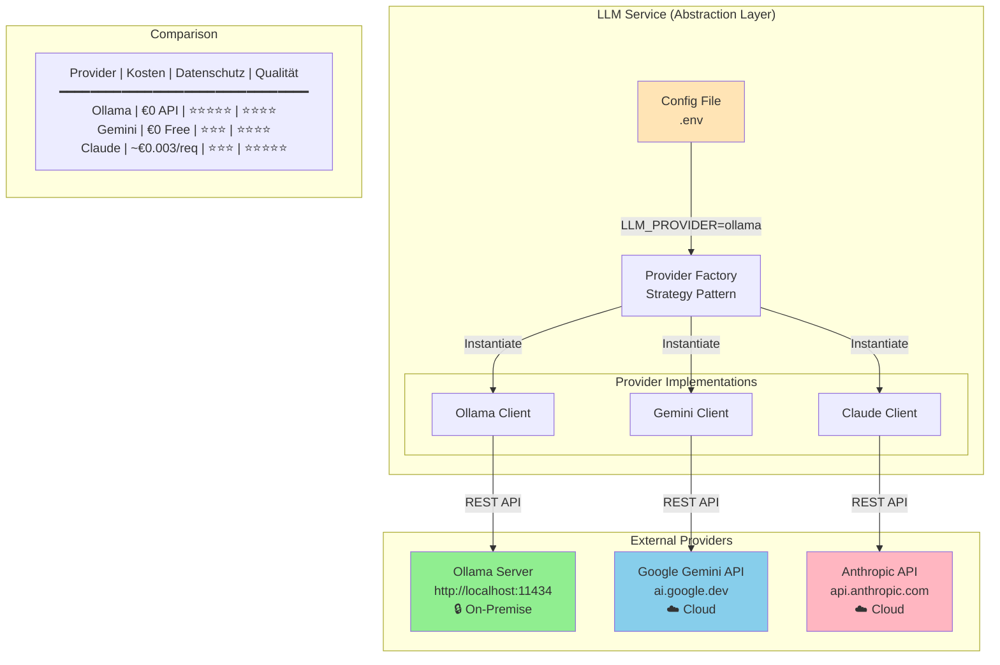
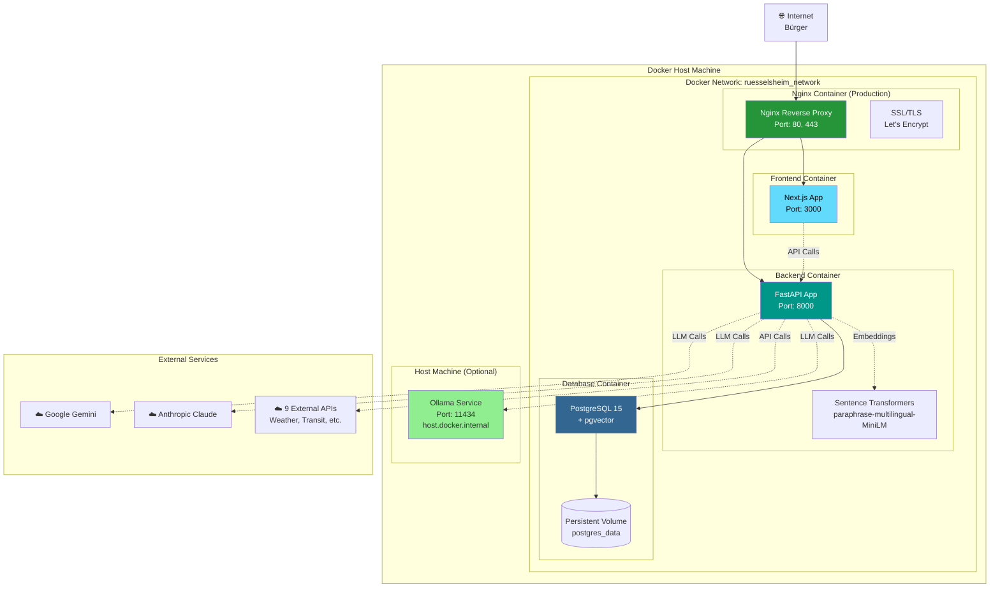
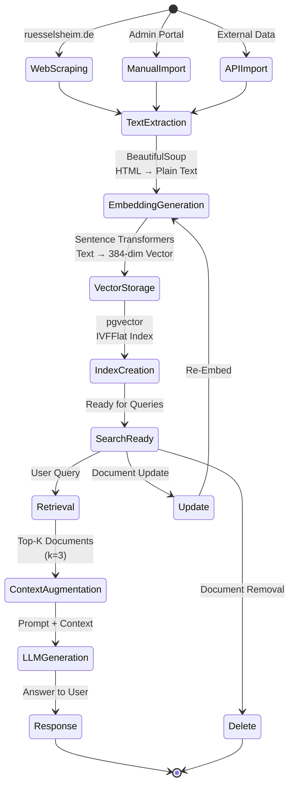
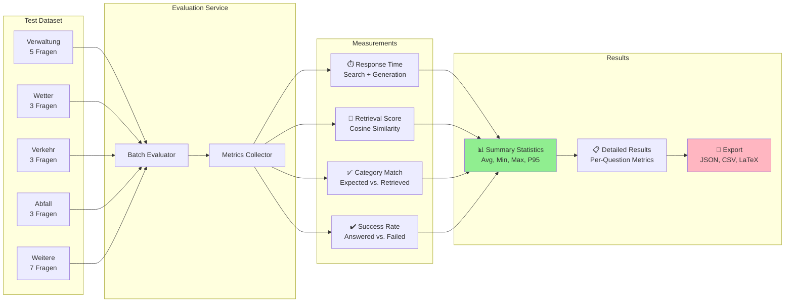

# Architektur-Diagramme für die Hausarbeit

## Diagramm 1: System-Architektur Übersicht



---

## Diagramm 2: RAG-Flow (Retrieval-Augmented Generation)



---

## Diagramm 3: Multi-Provider LLM-Architektur



---

## Diagramm 4: Deployment-Architektur (Docker Compose)



---

## Diagramm 5: RAG Document Lifecycle



---

## Diagramm 6: Evaluation Framework



---

## Verwendung der Diagramme

**Für die Hausarbeit (LaTeX/Word):**
1. Mermaid → PNG/SVG konvertieren via mermaid.live oder CLI
2. Diagramme in Paper einbinden mit Bildunterschriften
3. Referenzieren im Text: "Abbildung 1 zeigt die System-Architektur..."

**Für die PowerPoint:**
1. PNG Export in hoher Auflösung (300 DPI)
2. Pro Folie ein Diagramm mit Erklärung
3. Animationen für sequentielle Darstellung (z.B. RAG-Flow)

**Mermaid Live Editor:**
https://mermaid.live - Diagramme dort einfügen und als PNG/SVG exportieren

**CLI Export (falls mermaid-cli installiert):**
```bash
mmdc -i diagram.mmd -o diagram.png -w 1920 -H 1080
```
